# JVM 性能调优

在高性能硬件上部署程序，目前主要有两种方式：

- 通过 64 位 JDK 来使用大内存；
- 使用若干个 32 位虚拟机建立逻辑集群来利用硬件资源。

## 使用 64 位 JDK 管理大内存

堆内存变大后，虽然垃圾收集的频率减少了，但每次垃圾回收的时间变长。 如果堆内存为 14 G，那么每次 Full GC 将长达数十秒。如果 Full GC 频繁发生，那么对于一个网站来说是无法忍受的。

对于用户交互性强、对停顿时间敏感的系统，可以给 Java 虚拟机分配超大堆的前提是有把握把应用程序的 Full GC 频率控制得足够低，至少要低到不会影响用户使用。

可能面临的问题：

- 内存回收导致的长时间停顿；
- 现阶段，64 位 JDK 的性能普遍比 32 位 JDK 低；
- 需要保证程序足够稳定，因为这种应用要是产生堆溢出几乎就无法产生堆转储快照（因为要产生超过 10GB 的 Dump 文件），哪怕产生了快照也几乎无法进行分析；
- 相同程序在 64 位 JDK 消耗的内存一般比 32 位 JDK 大，这是由于指针膨胀，以及数据类型对齐补白等因素导致的。

## 使用 32 位 JVM 建立逻辑集群

在一台物理机器上启动多个应用服务器进程，每个服务器进程分配不同端口， 然后在前端搭建一个负载均衡器，以反向代理的方式来分配访问请求。

考虑到在一台物理机器上建立逻辑集群的目的仅仅是为了尽可能利用硬件资源，并不需要关心状态保留、热转移之类的高可用性能需求， 也不需要保证每个虚拟机进程有绝对的均衡负载，因此使用无 Session 复制的亲合式集群是一个不错的选择。 我们仅仅需要保障集群具备亲合性，也就是均衡器按一定的规则算法（一般根据 SessionID 分配） 将一个固定的用户请求永远分配到固定的一个集群节点进行处理即可。

可能遇到的问题：

- 尽量避免节点竞争全局资源，如磁盘竞争，各个节点如果同时访问某个磁盘文件的话，很可能导致 IO 异常；
- 很难高效利用资源池，如连接池，一般都是在节点建立自己独立的连接池，这样有可能导致一些节点池满了而另外一些节点仍有较多空余；
- 各个节点受到 32 位的内存限制；
- 大量使用本地缓存的应用，在逻辑集群中会造成较大的内存浪费，因为每个逻辑节点都有一份缓存，这时候可以考虑把本地缓存改成集中式缓存。

## 调优案例分析与实战

### 场景描述

一个小型系统，使用 32 位 JDK，4G 内存，测试期间发现服务端不定时抛出内存溢出异常。 加入 -XX:+HeapDumpOnOutOfMemoryError（添加这个参数后，堆内存溢出时就会输出异常日志）， 但再次发生内存溢出时，没有生成相关异常日志。

### 分析

在 32 位 JDK 上，1.6G 分配给堆，还有一部分分配给 JVM 的其他内存，直接内存最大也只能在剩余的 0.4G 空间中分出一部分， 如果使用了 NIO，JVM 会在 JVM 内存之外分配内存空间，那么就要小心“直接内存”不足时发生内存溢出异常了。

### 直接内存的回收过程

直接内存虽然不是 JVM 内存空间，但它的垃圾回收也由 JVM 负责。

垃圾收集进行时，虚拟机虽然会对直接内存进行回收， 但是直接内存却不能像新生代、老年代那样，发现空间不足了就通知收集器进行垃圾回收， 它只能等老年代满了后 Full GC，然后“顺便”帮它清理掉内存的废弃对象。 否则只能一直等到抛出内存溢出异常时，先 catch 掉，再在 catch 块里大喊 “`System.gc()`”。 要是虚拟机还是不听，那就只能眼睁睁看着堆中还有许多空闲内存，自己却不得不抛出内存溢出异常了。

## 调优案例实战
### 磁盘不足排查

其实，磁盘不足排查算是系统、程序层面的问题排查，并不算是JVM，但是另一方面考虑过来就是，系统磁盘的不足，也会导致JVM的运行异常，所以也把磁盘不足算进来了。并且排查磁盘不足，是比较简单，就是几个命令，然后就是逐层的排查，首先第一个命令就是**df -h**，查询磁盘的状态：

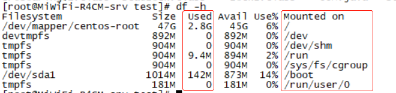 

从上面的显示中其中第一行使用的2.8G最大，然后是挂载在 **/** 目录下，我们直接**cd /**。然后通过执行：

```shell
du -sh *
```

查看各个文件的大小，找到其中最大的，或者说存储量级差不多的并且都非常大的文件，把那些没用的大文件删除就好。

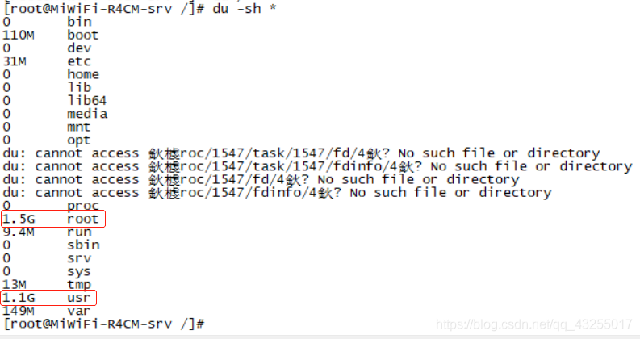 

然后，就是直接cd到对应的目录也是执行：du -sh *，就这样一层一层的执行，找到对应的没用的，然后文件又比较大的，可以直接删除。


### CPU过高排查

**排查过程**

- 使用`top`查找进程id
- 使用`top -Hp <pid>`查找进程中耗cpu比较高的线程id
- 使用`printf "%x\n" <pid>`将线程id十进制转十六进制
- 使用` jstack <pid> | grep <tid> -A 20`过滤出线程id锁关联的栈信息
- 根据栈信息中的调用链定位业务代码


案例代码如下：

```java
public class CPUSoaring {
        public static void main(String[] args) {

                Thread thread1 = new Thread(new Runnable(){
                        @Override
                        public void run() {
                                for (;;){
                                      System.out.println("I am children-thread1");
                                }
                        }
                },"children-thread1");
                
                 Thread thread2 = new Thread(new Runnable(){
                        @Override
                        public void run() {
                                for (;;){
                                      System.out.println("I am children-thread2");
                                }
                        }
                },"children-thread2");
                
                thread1.start();
                thread2.start();
                System.err.println("I am is main thread!!!!!!!!");
        }
}
```

- 第一步：首先通过**top**命令可以查看到id为**3806**的进程所占的CPU最高：

  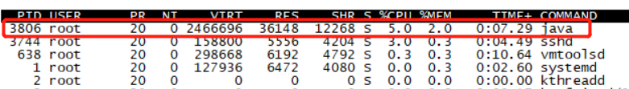

- 第二步：然后通过**top -Hp pid**命令，找到占用CPU最高的线程：

  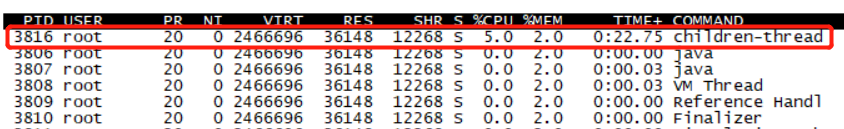

- 第三步：接着通过：**printf '%x\n' tid**命令将线程的tid转换为十六进制：xid：

  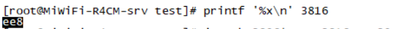

- 第四步：最后通过：**jstack pid|grep tid -A 30**命令就是输出线程的堆栈信息，线程所在的位置：

  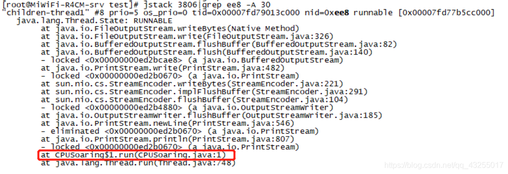

- 第五步：还可以通过**jstack -l pid > 文件名称.txt** 命令将线程堆栈信息输出到文件，线下查看。

  这就是一个CPU飙高的排查过程，目的就是要**找到占用CPU最高的线程所在的位置**，然后就是**review**你的代码，定位到问题的所在。使用Arthas的工具排查也是一样的，首先要使用top命令找到占用CPU最高的Java进程，然后使用Arthas进入该进程内，**使用dashboard命令排查占用CPU最高的线程。**，最后通过**thread**命令查看线程的信息。


### 内存打满排查

**排查过程**

- 查找进程id：`top -d 2 -c`
- 查看JVM堆内存分配情况：`jmap -heap pid`
- 查看占用内存比较多的对象：`jmap -histo pid | head -n 100`
- 查看占用内存比较多的存活对象：`jmap -histo:live pid | head -n 100`


**示例**

- 第一步：top -d 2 -c 

  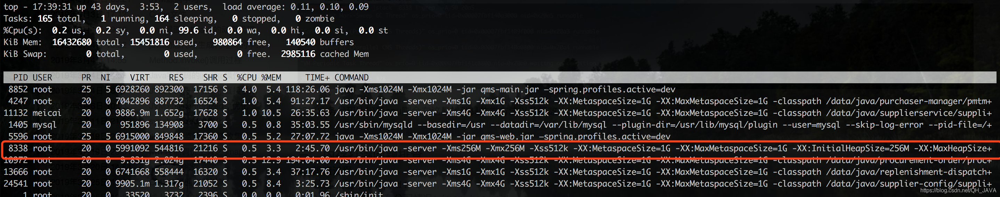

- 第二步：jmap -heap 8338

  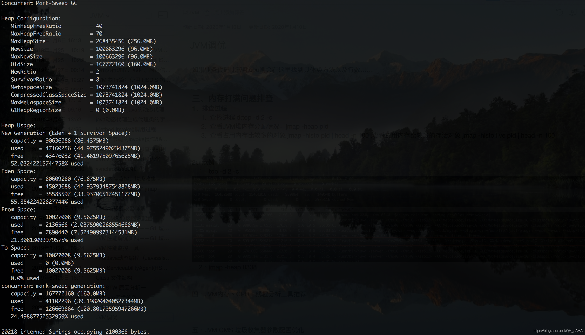

- 第三步：定位占用内存比较多的对象

  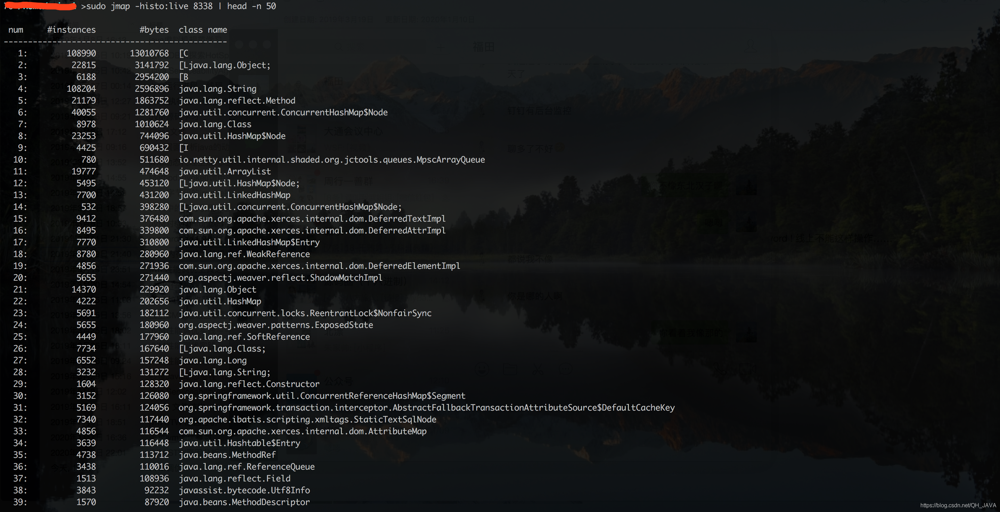

  这里就能看到对象个数以及对象大小……

  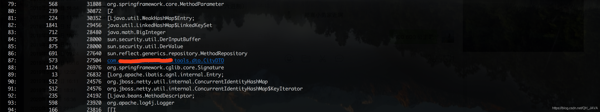

  这里看到一个自定义的类，这样我们就定位到具体对象，看看这个对象在那些地方有使用、为何会有大量的对象存在。


### OOM异常排查

OOM的异常排查也比较简单，首先服务上线的时候，要先设置这两个参数：

```shell
-XX:+HeapDumpOnOutOfMemoryError -XX:HeapDumpPath=${目录}
```

指定项目出现OOM异常的时候自动导出堆转储文件，然后通过内存分析工具（**Visual VM**）来进行线下的分析。

首先我们来聊一聊，哪些原因会导致OOM异常，站在JVM的分区的角度：

- **Java堆**
- **方法区**
- **虚拟机栈**
- **本地方法栈**
- **程序计数器**
- **直接内存**

只有**程序计数器**区域不会出现OOM，在Java 8及以上的**元空间**（本地内存）都会出现OOM。

而站在程序代码的角度来看，总结了大概有以下几点原因会导致OOM异常：

- **内存泄露**
- **对象过大、过多**
- **方法过长**
- **过度使用代理框架，生成大量的类信息**

接下来我们来看看OOM的排查，出现OOM异常后dump出了堆转储文件，然后打开jdk自带的Visual VM工具，导入堆转储文件，首先我使用的OOM异常代码如下：

```java
import java.util.ArrayList;
import java.util.List;

class OOM {

        static class User{
                private String name;
                private int age;

                public User(String name, int age){
                        this.name = name;
                        this.age = age;
                }
        }

        public static void main(String[] args) throws InterruptedException {
                List<User> list = new ArrayList<>();
                for (int i = 0; i < Integer.MAX_VALUE; i++) {
                        Thread.sleep(1000);
                        User user = new User("zhangsan"+i,i);
                        list.add(user);
                }
        }

}
```

代码很简单，就是往集合里面不断地add对象，带入堆转储文件后，在类和实例那栏就可以看到实例最多的类：

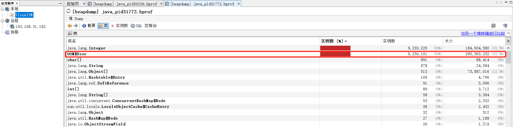

这样就找到导致OOM异常的类，还可以通过下面的方法查看导致OOM异常的线程堆栈信息，找到对应异常的代码段。

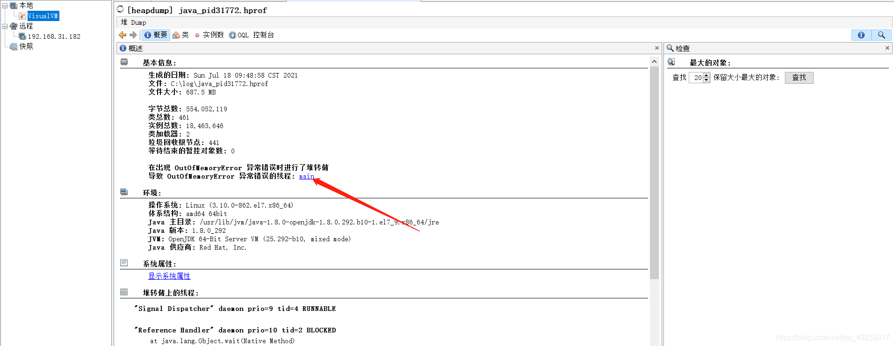

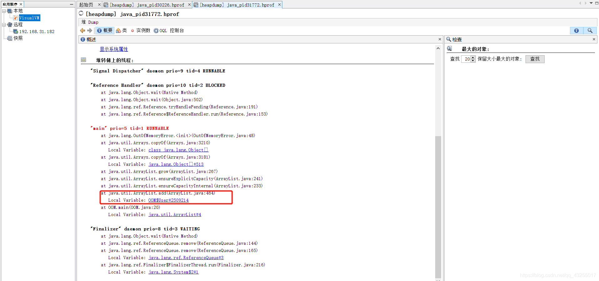

上面的方法是排查已经出现了OOM异常的方法，肯定是防线的最后一步，那么在此之前怎么防止出现OOM异常呢？

一般大厂都会有自己的监控平台，能够实施的**监控测试环境、预览环境、线上实施的服务健康状况（CPU、内存）** 等信息，对于频繁GC，并且GC后内存的回收率很差的，就要引起我们的注意了。

因为一般方法的长度合理，95%以上的对象都是朝生夕死，在**Minor GC**后只剩少量的存活对象，所以在代码层面上应该避免**方法过长、大对象**的现象。

每次自己写完代码，自己检查后，都可以提交给比自己高级别的工程师**review**自己的代码，就能及时的发现代码的问题，基本上代码没问题，百分之九十以上的问题都能避免，这也是大厂注重代码质量，并且时刻**review**代码的习惯。


### Jvisualvm

项目频繁YGC 、FGC问题排查

#### 内存问题

对象内存占用、实例个数监控

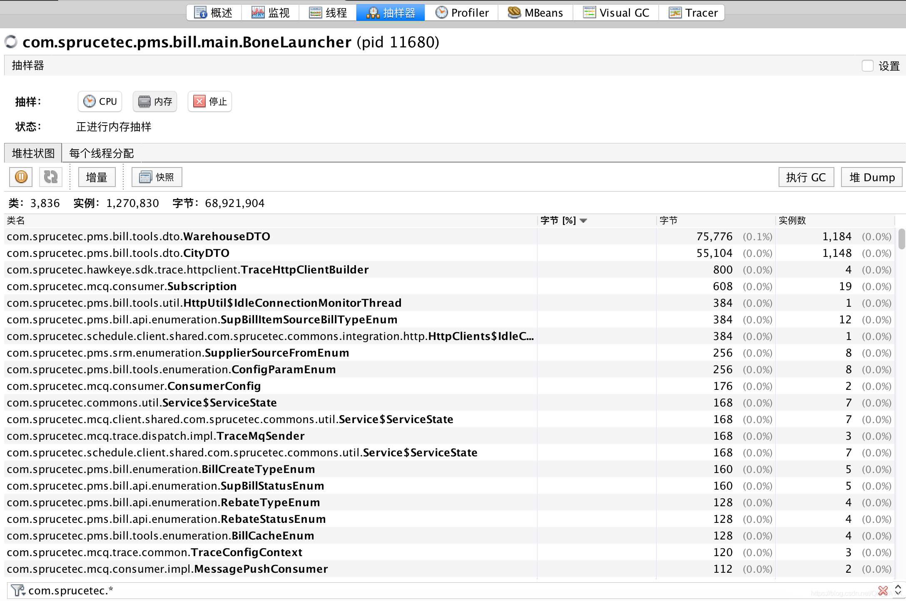


对象内存占用、年龄值监控

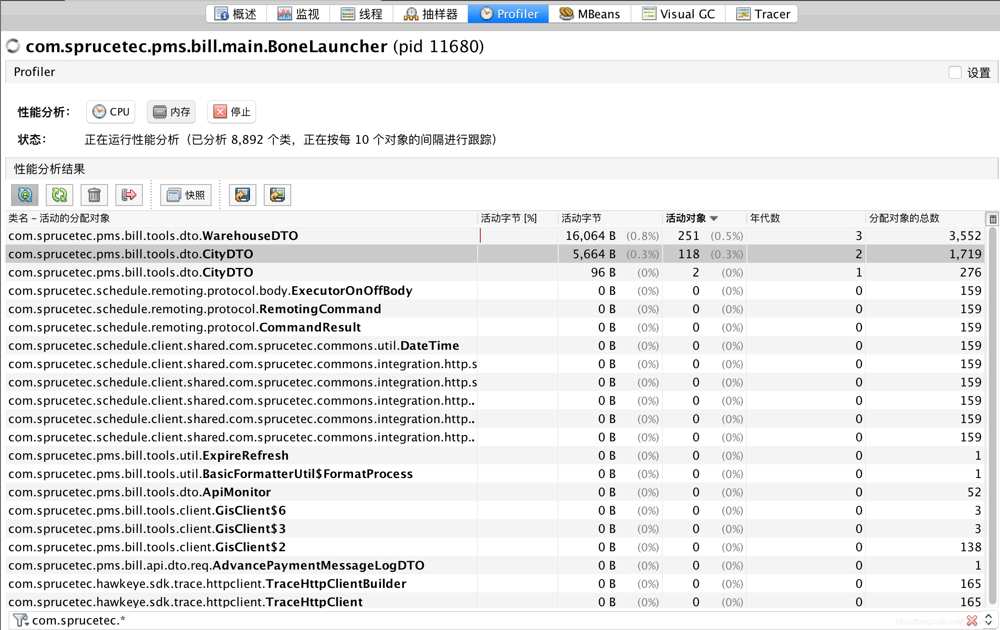


通过上面两张图发现这些对象占用内存比较大而且存活时间也是比较常，所以survivor 中的空间被这些对象占用，而如果缓存再次刷新则会创建同样大小对象来替换老数据，这时发现eden内存空间不足，就会触发yonggc 如果yonggc 结束后发现eden空间还是不够则会直接放到老年代，所以这样就产生了大对象的提前晋升，导致fgc增加……

**优化办法**：优化两个缓存对象，将缓存对象大小减小。优化一下两个对象，缓存关键信息！


#### CPU耗时问题排查

Cpu使用耗时监控：

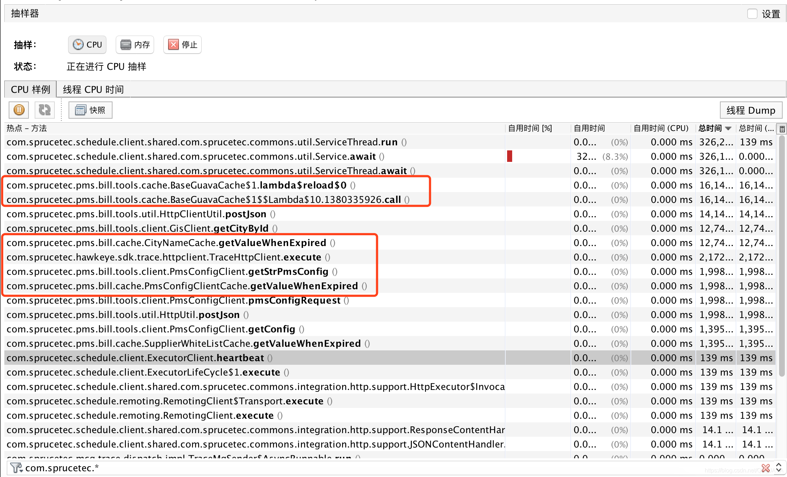

耗时、调用次数监控：

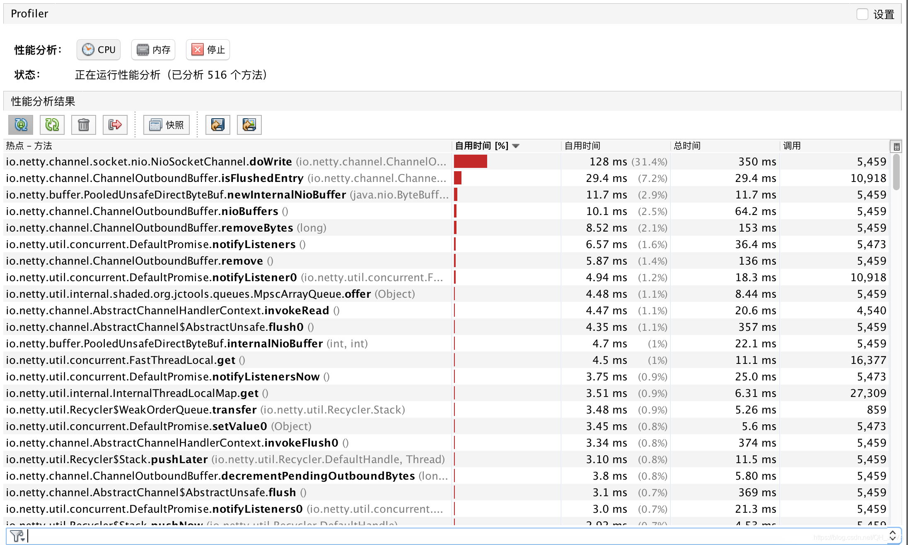

从上面监控图可以看到主要耗时还是在网络请求，没有看到具体业务代码消耗过错cpu……


### 调优堆内存分配

**初始堆空间大小设置**

- 使用系统默认配置在系统稳定运行一段时间后查看记录内存使用情况：Eden、survivor0 、survivor1 、old、metaspace
- 按照通用法则通过gc信息分配调整大小，整个堆大小是Full GC后老年代空间占用大小的3-4倍
- 老年代大小为Full GC后老年代空间占用大小的2-3倍
- 新生代大小为Full GC后老年代空间占用大小的1-1.5倍 
- 元数据空间大小为Full GC后元数据空间占用大小的1.2-1.5倍

活跃数大小是应用程序运行在稳定态时，长期存活的对象在java堆中占用的空间大小。也就是在应用趋于稳太时FullGC之后Java堆中存活对象占用空间大小。（注意在jdk8中将jdk7中的永久代改为元数据区，metaspace 使用的物理内存，不占用堆内存）


**堆大小调整的着手点、分析点**

- 统计Minor GC 持续时间
- 统计Minor GC 的次数
- 统计Full GC的最长持续时间
- 统计最差情况下Full GC频率
- 统计GC持续时间和频率对优化堆的大小是主要着手点，我们按照业务系统对延迟和吞吐量的需求，在按照这些分析我们可以进行各个区大小的调整


### 年轻代调优

**年轻代调优规则**

- 老年代空间大小不应该小于活跃数大小1.5倍。老年代空间大小应为老年代活跃数2-3倍
- 新生代空间至少为java堆内存大小的10% 。新生代空间大小应为1-1.5倍的老年代活跃数
- 在调小年轻代空间时应保持老年代空间不变


MinorGC是收集eden+from survivor 区域的，当业务系统匀速生成对象的时候如果年轻带分配内存偏小会发生频繁的MinorGC，如果分配内存过大则会导致MinorGC停顿时间过长，无法满足业务延迟性要求。所以按照堆分配空间分配之后分析gc日志，看看MinorGC的频率和停顿时间是否满足业务要求。

- **MinorGC频繁原因**
  MinorGC 比较频繁说明eden内存分配过小，在恒定的对象产出的情况下很快无空闲空间来存放新对象所以产生了MinorGC,所以eden区间需要调大。

- **年轻代大小调整**
  Eden调整到多大那，我们可以查看GC日志查看业务多长时间填满了eden空间，然后按照业务能承受的收集频率来计算eden空间大小。比如eden空间大小为128M每5秒收集一次，则我们为了达到10秒收集一次则可以调大eden空间为256M这样能降低收集频率。年轻代调大的同时相应的也要调大老年代，否则有可能会出现频繁的concurrent model  failed  从而导致Full GC 。

- **MinorGC停顿时间过长**
  MinorGC 收集过程是要产生STW的。如果年轻代空间太大，则gc收集时耗时比较大，所以我们按业务对停顿的要求减少内存，比如现在一次MinorGC 耗时12.8毫秒，eden内存大小192M ,我们为了减少MinorGC 耗时我们要减少内存。比如我们MinorGC 耗时标准为10毫秒，这样耗时减少16.6% 同样年轻代内存也要减少16.6% 即192*0.1661 = 31.89M 。年轻代内存为192-31.89=160.11M,在减少年轻代大小，而要保持老年代大小不变则要减少堆内存大小至512-31.89=480.11M


堆内存：512M 年轻代: 192M  收集11次耗时141毫秒 12.82毫秒/次

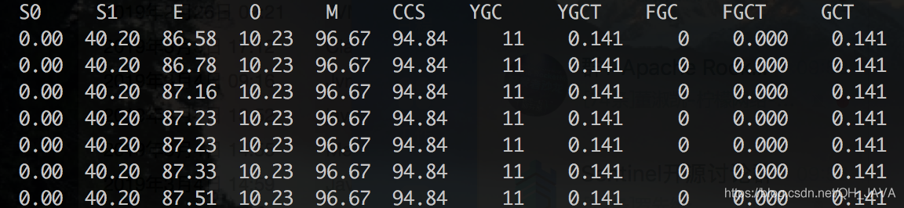

堆内存：512M 年轻代：192M 收集12次耗时151毫秒   12.85毫秒/次

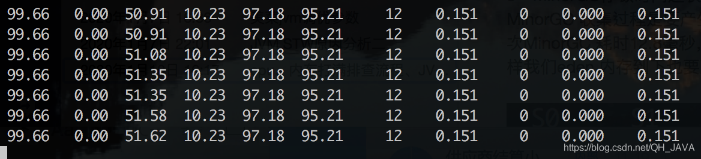

**按照上面计算调优**
堆内存： 480M 年轻带： 160M 收集14次 耗时154毫秒  11毫秒/次 相比之前的 12.82毫秒/次 停顿时间减少1.82毫秒

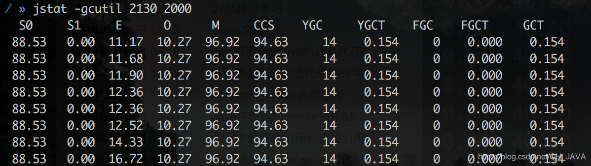

**但是还没达到10毫秒的要求，继续按照这样的逻辑进行  11-10=1 ；1/11= 0.909 即 0.09 所以耗时还要降低9%。**
年轻代减少：160*0.09 = 14.545=14.55 M;  160-14.55 =145.45=145M 
堆大小： 480-14.55 = 465.45=465M
但是在这样调整后使用jmap -heap 查看的时候年轻代大小和实际配置数据有出入（年轻代大小为150M大于配置的145M），这是因为-XX:NewRatio 默认2 即年轻代和老年代1：2的关系，所以这里将-XX:NewRatio 设置为3 即年轻代、老年大小比为1：3 ，最终堆内存大小为：

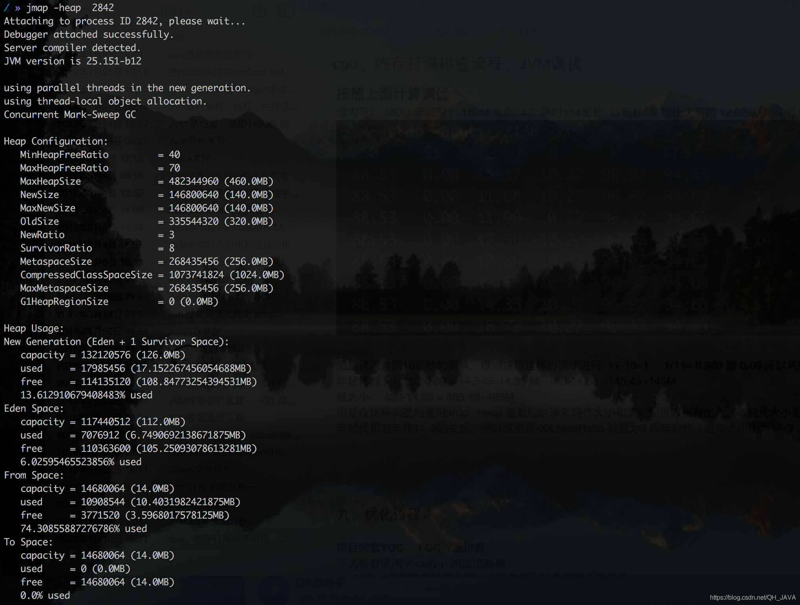

MinorGC耗时 159/16=9.93毫秒

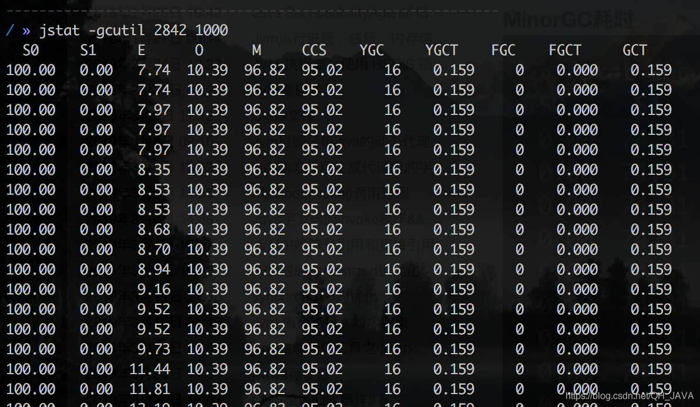

MinorGC耗时 185/18=10.277=10.28毫秒

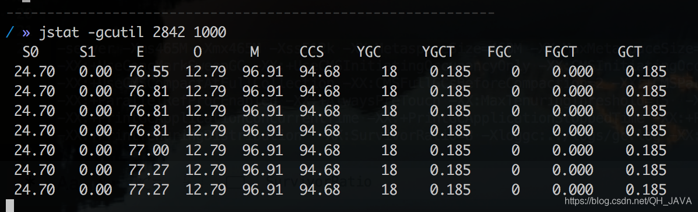

MinorGC耗时 205/20=10.25毫秒

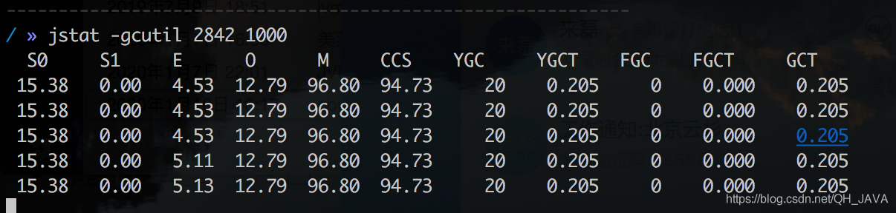


Ok 这样MinorGC停顿时间过长问题解决，MinorGC要么比较频繁要么停顿时间比较长，解决这个问题就是调整年轻代大小，但是调整的时候还是要遵守这些规则。


### 老年代调优
按照同样的思路对老年代进行调优，同样分析FullGC 频率和停顿时间，按照优化设定的目标进行老年代大小调整。

**老年代调优流程**

- 分析每次MinorGC 之后老年代空间占用变化，计算每次MinorGC之后晋升到老年代的对象大小
- 按照MinorGC频率和晋升老年代对象大小计算提升率即每秒钟能有多少对象晋升到老年代
- FullGC之后统计老年代空间被占用大小计算老年带空闲空间，再按照第2部计算的晋升率计算该老年代空闲空间多久会被填满而再次发生FullGC，同样观察FullGC 日志信息，计算FullGC频率，如果频率过高则可以增大老年代空间大小老解决，增大老年代空间大小应保持年轻代空间大小不变
- 如果在FullGC 频率满足优化目标而停顿时间比较长的情况下可以考虑使用CMS、G1收集器。并发收集减少停顿时间
  

### 栈溢出

栈溢出异常的排查（包括**虚拟机栈、本地方法栈**）基本和OOM的一场排查是一样的，导出异常的堆栈信息，然后使用mat或者Visual VM工具进行线下分析，找到出现异常的代码或者方法。

当线程请求的栈深度大于虚拟机栈所允许的大小时，就会出现**StackOverflowError**异常，二从代码的角度来看，导致线程请求的深度过大的原因可能有：**方法栈中对象过大，或者过多，方法过长从而导致局部变量表过大，超过了-Xss参数的设置**。


### 死锁排查

死锁的案例演示的代码如下：

```java
public class DeadLock {

	public static Object lock1 = new Object();
	public static Object lock2 = new Object();

	public static void main(String[] args){
		Thread a = new Thread(new Lock1(),"DeadLock1");
		Thread b = new Thread(new Lock2(),"DeadLock2");
		a.start();
		b.start();
	}
}
class Lock1 implements Runnable{
	@Override
	public void run(){
		try{
			while(true){
				synchronized(DeadLock.lock1){
					System.out.println("Waiting for lock2");
					Thread.sleep(3000);
					synchronized(DeadLock.lock2){
						System.out.println("Lock1 acquired lock1 and lock2 ");
					}
				}
			}
		}catch(Exception e){
			e.printStackTrace();
		}
	}
}
class Lock2 implements Runnable{
	@Override
	public void run(){
		try{
			while(true){
				synchronized(DeadLock.lock2){
					System.out.println("Waiting for lock1");
					Thread.sleep(3000);
					synchronized(DeadLock.lock1){
						System.out.println("Lock2 acquired lock1 and lock2");
					}
				}
			}
		}catch(Exception e){
			e.printStackTrace();
		}
	}
}
```

上面的代码非常的简单，就是两个类的实例作为锁资源，然后分别开启两个线程，不同顺序的对锁资源资源进行加锁，并且获取一个锁资源后，等待三秒，是为了让另一个线程有足够的时间获取另一个锁对象。

运行上面的代码后，就会陷入死锁的僵局：

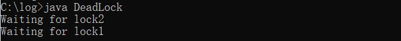

对于死锁的排查，若是在测试环境或者本地，直接就可以使用Visual VM连接到该进程，如下界面就会自动检测到死锁的存在

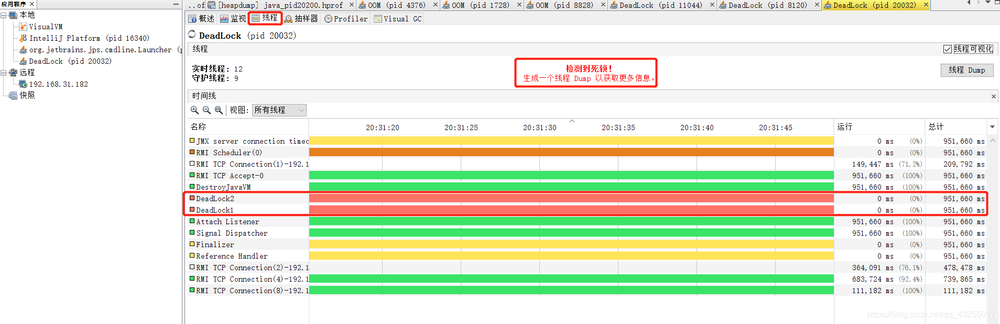

并且查看线程的堆栈信息。就能看到具体的死锁的线程：

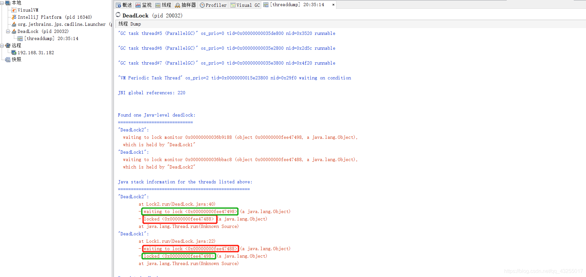

线上的话可以上用Arthas也可以使用原始的命令进行排查，原始命令可以先使用**jps**查看具体的Java进程的ID，然后再通过**jstack ID**查看进程的线程堆栈信息，他也会自动给你提示有死锁的存在：

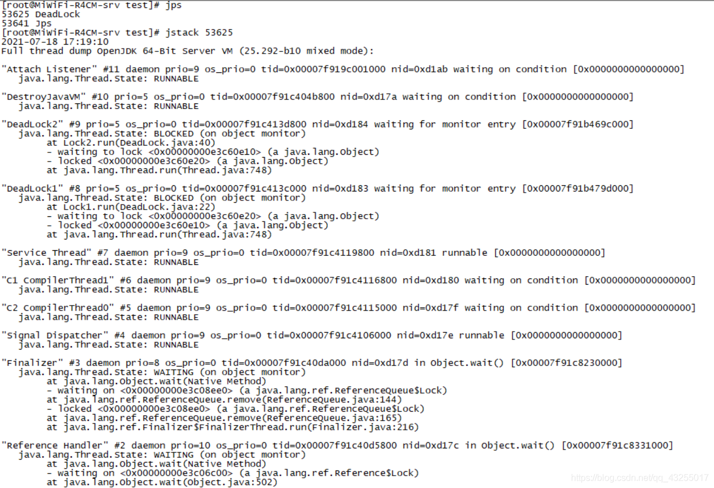

Arthas工具可以使用**thread**命令排查死锁，要关注的是**BLOCKED**状态的线程，如下图所示：

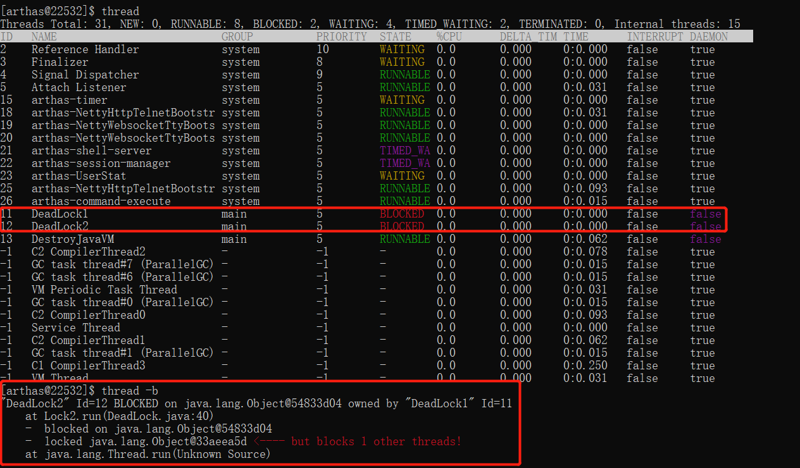

具体thread的详细参数可以参考如下图所示：

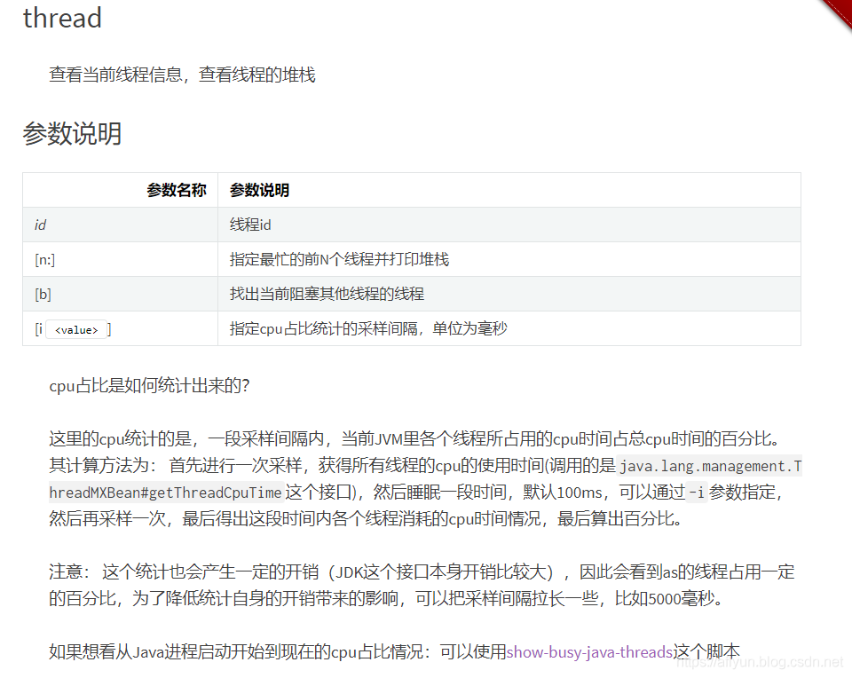


**如何避免死锁**

上面我们聊了如何排查死锁，下面我们来聊一聊如何避免死锁的发生，从上面的案例中可以发现，死锁的发生两个线程同时都持有对方不释放的资源进入僵局。所以，在代码层面，要避免死锁的发生，主要可以从下面的四个方面进行入手：

- **首先避免线程的对于资源的加锁顺序要保持一致**

- **并且要避免同一个线程对多个资源进行资源的争抢**

- **另外的话，对于已经获取到的锁资源，尽量设置失效时间，避免异常，没有释放锁资源，可以使用acquire() 方法加锁时可指定 timeout 参数**

- **最后，就是使用第三方的工具检测死锁，预防线上死锁的发生**

死锁的排查已经说完了，上面的基本就是问题的排查，也可以算是调优的一部分吧，但是对于JVM调优来说，重头戏应该是在**Java堆**，这部分的调优才是重中之重。


### 调优实战

上面说完了调优的目的和调优的指标，那么我们就来实战调优，首先准备我的案例代码，如下：

```java
import java.util.ArrayList;
import java.util.List;

class OOM {

	static class User{
		private String name;
		private int age;

		public User(String name, int age){
			this.name = name;
			this.age = age;
		}

	}

	public static void main(String[] args) throws InterruptedException {
		List<User> list = new ArrayList<>();
		for (int i = 0; i < Integer.MAX_VALUE; i++) {
		     Tread.sleep(1000);
			System.err.println(Thread.currentThread().getName());
			User user = new User("zhangsan"+i,i);
			list.add(user);
		}
	}
}
```

案例代码很简单，就是不断的往一个集合里里面添加对象，首先初次我们启动的命令为：

```shell
java   -XX:+PrintGCDetails -XX:+PrintGCDateStamps -XX:+UseGCLogFileRotation -XX:+PrintHeapAtGC -XX:NumberOfGCLogFiles=5 -XX:GCLogFileSize=50M -Xloggc:./logs/emps-gc-%t.log -XX:+HeapDumpOnOutOfMemoryError -XX:HeapDumpPath=./logs/emps-heap.dump OOM
```

就是纯粹的设置了一些GC的打印日志，然后通过Visual VM来看GC的显示如下：

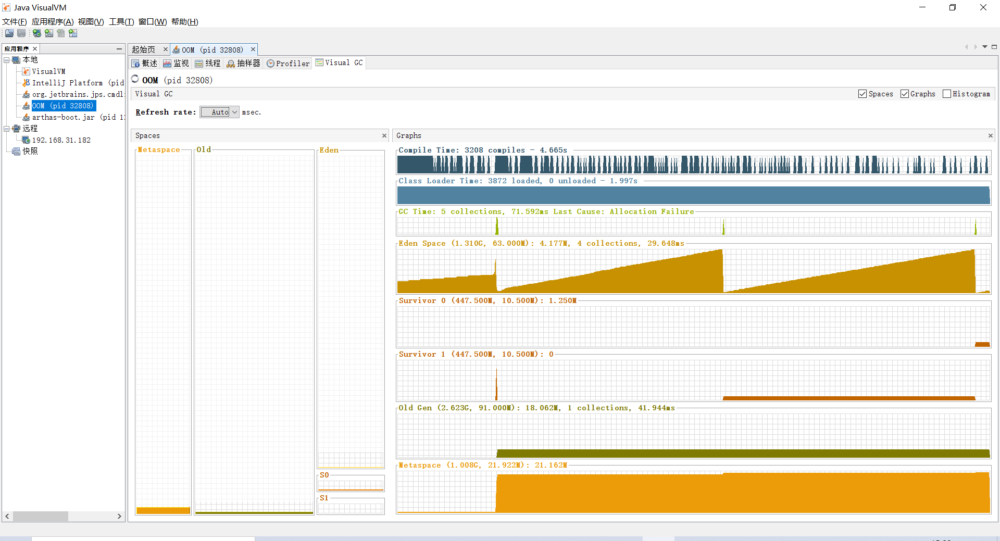

可以看到一段时间后出现4次Minor GC，使用的时间是29.648ms，发生一次Full GC使用的时间是41.944ms。

Minor GC非常频繁，Full GC也是，在短时间内就发生了几次，观察输出的日志发现以及Visual VM的显示来看，都是因为内存没有设置，太小，导致Minor GC频繁。

因此，我们第二次适当的增大Java堆的大小，调优设置的参数为：

```shell
java -Xmx2048m -Xms2048m -Xmn1024m -Xss256k  -XX:+UseConcMarkSweepGC  -XX:+PrintGCDetails -XX:+PrintGCDateStamps -XX:+UseGCLogFileRotation -XX:+PrintHeapAtGC -XX:NumberOfGCLogFiles=5 -XX:GCLogFileSize=50M -Xloggc:./logs/emps-gc-%t.log -XX:+HeapDumpOnOutOfMemoryError -XX:HeapDumpPath=./logs/emps-heap.dump OOM
```

观察一段时间后，结果如下图所示：

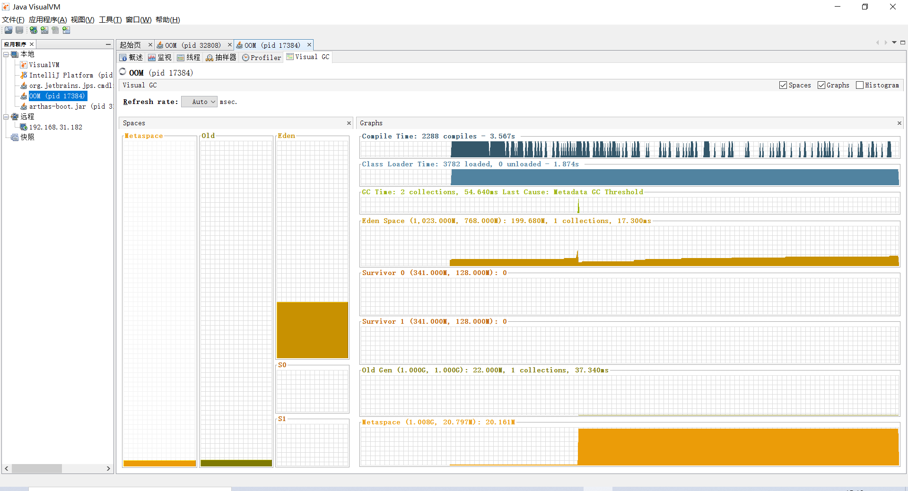

可以发现Minor GC次数明显下降，但是还是发生了Full GC，根据打印的日志来看，是因为元空间的内存不足，看了上面的Visual VM元空间的内存图，也是一样，基本都到顶了：

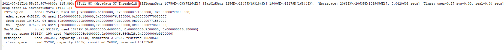

因此第三次对于元空间的区域设置大一些，并且将GC回收器换成是CMS的，设置的参数如下：

```shell
java -Xmx2048m -Xms2048m -Xmn1024m -Xss256k -XX:MetaspaceSize=100m -XX:MaxMetaspaceSize=100m -XX:+UseConcMarkSweepGC  -XX:+PrintGCDetails -XX:+PrintGCDateStamps -XX:+UseGCLogFileRotation -XX:+PrintHeapAtGC -XX:NumberOfGCLogFiles=5 -XX:GCLogFileSize=50M -Xloggc:./logs/emps-gc-%t.log -XX:+HeapDumpOnOutOfMemoryError -XX:HeapDumpPath=./logs/emps-heap.dump OOM
```

观察相同的时间后，Visual VM的显示图如下：

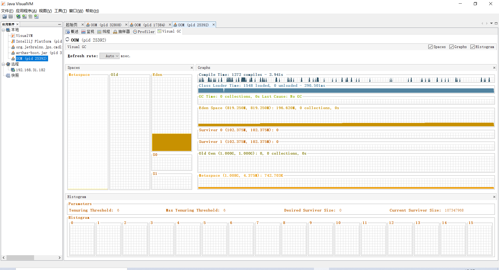

同样的时间，一次Minor GC和Full GC都没有发生，所以这样我觉得也算是已经调优了。

但是调优并不是一味的调大内存，是要在各个区域之间取得平衡，可以适当的调大内存，以及更换GC种类，举个例子，当把上面的案例代码的Thread.sleep(1000)给去掉。

然后再来看Visual VM的图，如下：

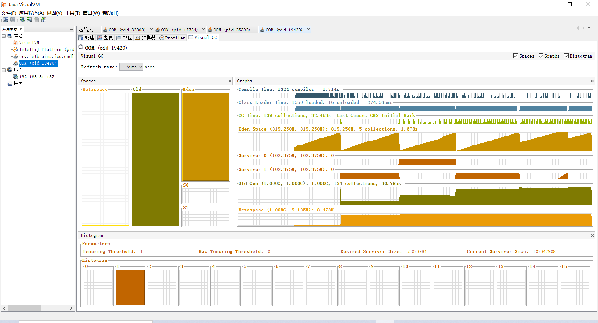

可以看到Minor GC也是非常频繁的，因为这段代码本身就是不断的增大内存，直到OOM异常，真正的实际并不会这样，可能当内存增大到一定两级后，就会在一段范围平衡。

当我们将上面的情况，再适当的增大内存，JVM参数如下：

```shell
java -Xmx4048m -Xms4048m -Xmn2024m -XX:SurvivorRatio=7  -Xss256k -XX:MetaspaceSize=300m -XX:MaxMetaspaceSize=100m -XX:+UseConcMarkSweepGC  -XX:+PrintGCDetails -XX:+PrintGCDateStamps -XX:+UseGCLogFileRotation -XX:+PrintHeapAtGC -XX:NumberOfGCLogFiles=5 -XX:GCLogFileSize=50M -Xloggc:./logs/emps-gc-%t.log -XX:+HeapDumpOnOutOfMemoryError -XX:HeapDumpPath=./logs/emps-heap.dump OOM
```

可以看到相同时间内，确实Minor GC减少了，但是时间增大了，因为复制算法，基本都是存活的，复制需要耗费大量的性能和时间：

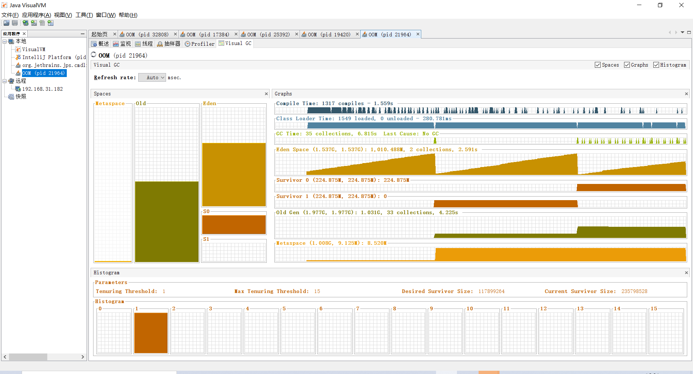

所以，调优要有取舍，取得一个平衡点，性能、状态达到佳就OK了，并没最佳的状态，这就是调优的基本法则，而且调优也是一个细活，所谓慢工出细活，需要耗费大量的时间，慢慢调，不断的做对比。


### 调优参数

#### 堆

- -Xms1024m 设置堆的初始大小
- -Xmx1024m 设置堆的最大大小
- -XX:NewSize=1024m 设置年轻代的初始大小
- -XX:MaxNewSize=1024m 设置年轻代的最大值
- -XX:SurvivorRatio=8 Eden和S区的比例
- -XX:NewRatio=4 设置老年代和新生代的比例
- -XX:MaxTenuringThreshold=10 设置晋升老年代的年龄条件


#### 栈

- -Xss128k


#### 元空间

- -XX:MetasapceSize=200m 设置初始元空间大小
- -XX:MaxMatespaceSize=200m 设置最大元空间大小 默认无限制


#### 直接内存

- -XX:MaxDirectMemorySize 设置直接内存的容量，默认与堆最大值一样


#### 日志

- -Xloggc:/opt/app/ard-user/ard-user-gc-%t.log   设置日志目录和日志名称
- -XX:+UseGCLogFileRotation           开启滚动生成日志
- -XX:NumberOfGCLogFiles=5            滚动GC日志文件数，默认0，不滚动
- -XX:GCLogFileSize=20M               GC文件滚动大小，需开 UseGCLogFileRotation
- -XX:+PrintGCDetails      开启记录GC日志详细信息（包括GC类型、各个操作使用的时间）,并且在程序运行结束打印出JVM的内存占用情况
- -XX:+ PrintGCDateStamps             记录系统的GC时间
- -XX:+PrintGCCause                   产生GC的原因(默认开启)


#### GC

##### Serial垃圾收集器（新生代）

开启

- -XX:+UseSerialGC

关闭：

- -XX:-UseSerialGC //新生代使用Serial  老年代则使用SerialOld


##### Parallel Scavenge收集器（新生代）开启

- -XX:+UseParallelOldGC 关闭
- -XX:-UseParallelOldGC  新生代使用功能Parallel Scavenge 老年代将会使用Parallel Old收集器


##### ParallelOl垃圾收集器（老年代）开启

- -XX:+UseParallelGC 关闭
- -XX:-UseParallelGC 新生代使用功能Parallel Scavenge 老年代将会使用Parallel Old收集器


##### ParNew垃圾收集器（新生代）开启

- -XX:+UseParNewGC 关闭
- -XX:-UseParNewGC //新生代使用功能ParNew 老年代则使用功能CMS


##### CMS垃圾收集器（老年代）开启

- -XX:+UseConcMarkSweepGC 关闭
- -XX:-UseConcMarkSweepGC
- -XX:MaxGCPauseMillis  GC停顿时间，垃圾收集器会尝试用各种手段达到这个时间，比如减小年轻代
- -XX:+UseCMSCompactAtFullCollection 用于在CMS收集器不得不进行FullGC时开启内存碎片的合并整理过程，由于这个内存整理必须移动存活对象，（在Shenandoah和ZGC出现前）是无法并发的
- -XX：CMSFullGCsBefore-Compaction 多少次FullGC之后压缩一次，默认值为0，表示每次进入FullGC时都进行碎片整理）
- -XX:CMSInitiatingOccupancyFraction 当老年代使用达到该比例时会触发FullGC，默认是92
- -XX:+UseCMSInitiatingOccupancyOnly 这个参数搭配上面那个用，表示是不是要一直使用上面的比例触发FullGC，如果设置则只会在第一次FullGC的时候使用-XX:CMSInitiatingOccupancyFraction的值，之后会进行自动调整
- -XX:+CMSScavengeBeforeRemark 在FullGC前启动一次MinorGC，目的在于减少老年代对年轻代的引用，降低CMSGC的标记阶段时的开销，一般CMS的GC耗时80%都在标记阶段
- -XX:+CMSParallellnitialMarkEnabled 默认情况下初始标记是单线程的，这个参数可以让他多线程执行，可以减少STW
- -XX:+CMSParallelRemarkEnabled 使用多线程进行重新标记，目的也是为了减少STW


##### G1垃圾收集器开启

- -XX:+UseG1GC 关闭
- -XX:-UseG1GC
- -XX：G1HeapRegionSize 设置每个Region的大小，取值范围为1MB～32MB
- -XX：MaxGCPauseMillis 设置垃圾收集器的停顿时间，默认值是200毫秒，通常把期望停顿时间设置为一两百毫秒或者两三百毫秒会是比较合理的


## JDK Tools

### jps

用于显示当前用户下的所有java进程信息：

```shell
# jps [options] [hostid] 
# q:仅输出VM标识符, m: 输出main method的参数,l:输出完全的包名, v:输出jvm参数
[root@localhost ~]# jps -l
28729 sun.tools.jps.Jps
23789 cn.ms.test.DemoMain
23651 cn.ms.test.TestMain
```


### jstat

用于监视虚拟机运行时状态信息（类装载、内存、垃圾收集、JIT编译等运行数据）：

**-gc**：垃圾回收统计（大小）

```shell
# 每隔2000ms输出<pid>进程的gc情况，一共输出2次
[root@localhost ~]# jstat -gc <pid> 2000 2
# 每隔2s输出<pid>进程的gc情况，每个3条记录就打印隐藏列标题
[root@localhost ~]# jstat -gc -t -h3 <pid> 2s
Timestamp        S0C    S1C    S0U    S1U    ... YGC     YGCT    FGC    FGCT     GCT   
         1021.6 1024.0 1024.0  0.0   1024.0  ...  1    0.012   0      0.000    0.012
         1023.7 1024.0 1024.0  0.0   1024.0  ...  1    0.012   0      0.000    0.012
         1025.7 1024.0 1024.0  0.0   1024.0  ...  1    0.012   0      0.000    0.012
Timestamp        S0C    S1C    S0U    S1U    ... YGC     YGCT    FGC    FGCT     GCT   
         1027.7 1024.0 1024.0  0.0   1024.0  ...  1    0.012   0      0.000    0.012
         1029.7 1024.0 1024.0  0.0   1024.0  ...  1    0.012   0      0.000    0.012
# 结果说明: C即Capacity 总容量，U即Used 已使用的容量
##########################
# S0C：年轻代中第一个survivor（幸存区）的容量 (kb)
# S1C：年轻代中第二个survivor（幸存区）的容量 (kb)
# S0U：年轻代中第一个survivor（幸存区）目前已使用空间 (kb)
# S1U：年轻代中第二个survivor（幸存区）目前已使用空间 (kb)
# EC：年轻代中Eden（伊甸园）的容量 (kb)
# EU：年轻代中Eden（伊甸园）目前已使用空间 (kb)
# OC：Old代的容量 (kb)
# OU：Old代目前已使用空间 (kb)
# PC：Perm(持久代)的容量 (kb)
# PU：Perm(持久代)目前已使用空间 (kb)
# YGC：从应用程序启动到采样时年轻代中gc次数
# YGCT：从应用程序启动到采样时年轻代中gc所用时间(s)
# FGC：从应用程序启动到采样时old代(全gc)gc次数
# FGCT：从应用程序启动到采样时old代(全gc)gc所用时间(s)
# GCT：从应用程序启动到采样时gc用的总时间(s)
```

**-gcutil**：垃圾回收统计（百分比）

```shell
[root@localhost bin]# jstat -gcutil <pid>
  S0     S1     E      O      M     CCS    YGC     YGCT    FGC    FGCT     GCT
  0.00  99.80  16.21  26.18  93.34  90.74      9    0.056     2    0.045    0.102
# 结果说明
##########################
# S0：年轻代中第一个survivor（幸存区）已使用的占当前容量百分比
# S1：年轻代中第二个survivor（幸存区）已使用的占当前容量百分比
# E：年轻代中Eden（伊甸园）已使用的占当前容量百分比
# O：old代已使用的占当前容量百分比
# P：perm代已使用的占当前容量百分比
# YGC：从应用程序启动到采样时年轻代中gc次数
# YGCT：从应用程序启动到采样时年轻代中gc所用时间(s)
# FGC：从应用程序启动到采样时old代(全gc)gc次数
# FGCT：从应用程序启动到采样时old代(全gc)gc所用时间(s)
# GCT：从应用程序启动到采样时gc用的总时间(s)
```

**-gccapacity**：堆内存统计

```shell
[root@localhost ~]# jstat -gccapacity <pid>
 NGCMN    NGCMX     NGC     S0C   S1C       EC      OGCMN      OGCMX       OGC         OC      PGCMN    PGCMX     PGC       PC     YGC    FGC 
 84480.0 1349632.0 913408.0 54272.0 51200.0 502784.0   168448.0  2699264.0   168448.0   168448.0  21504.0  83968.0  51712.0  51712.0      9     0
# 结果说明
##########################
# NGCMN：年轻代(young)中初始化(最小)的大小 (kb)
# NGCMX：年轻代(young)的最大容量 (kb)
# NGC：年轻代(young)中当前的容量 (kb)
# S0C：年轻代中第一个survivor（幸存区）的容量 (kb)
# S1C：年轻代中第二个survivor（幸存区）的容量 (kb)
# EC：年轻代中Eden（伊甸园）的容量 (kb)
# OGCMN：old代中初始化(最小)的大小 (kb)
# OGCMX：old代的最大容量 (kb)
# OGC：old代当前新生成的容量 (kb)
# OC：Old代的容量 (kb)
# PGCMN：perm代中初始化(最小)的大小 (kb)
# PGCMX：perm代的最大容量 (kb)
# PGC：perm代当前新生成的容量 (kb)
# PC：Perm(持久代)的容量 (kb)
# YGC：从应用程序启动到采样时年轻代中gc次数
# GCT：从应用程序启动到采样时gc用的总时间(s)
```

**-gccause**：垃圾收集统计概述（同-gcutil），附加最近两次垃圾回收事件的原因

```shell
[root@localhost ~]# jstat -gccause <pid>
  S0     S1     E      O      P     YGC     YGCT    FGC    FGCT     GCT    LGCC                 GCC       
  0.00  79.23  39.37  39.92  99.74      9    0.198     0    0.000    0.198 Allocation Failure   No GC
# 结果说明
##########################
# LGCC：最近垃圾回收的原因
# GCC：当前垃圾回收的原因
```


### jstack

jstack(Java Stack Trace)主要用于打印线程的堆栈信息，是JDK自带的很强大的线程分析工具，可以帮助我们排查程序运行时的线程状态、死锁状态等。

```shell
# dump出进程<pid>的线程堆栈快照至/data/1.log文件中
jstack -l <pid> >/data/1.log

# 参数说明：
# -F：如果正常执行jstack命令没有响应（比如进程hung住了），可以加上此参数强制执行thread dump
# -m：除了打印Java的方法调用栈之外，还会输出native方法的栈帧
# -l：打印与锁有关的附加信息。使用此参数会导致JVM停止时间变长，在生产环境需慎用
```

jstack dump文件中值得关注的线程状态有：

- **死锁（Deadlock） —— 重点关注**
- 执行中（Runnable）  
- **等待资源（Waiting on condition） —— 重点关注**
  - 等待某个资源或条件发生来唤醒自己。具体需结合jstacktrace来分析，如线程正在sleep，网络读写繁忙而等待
  - 如果大量线程在“waiting on condition”，并且在等待网络资源，可能是网络瓶颈的征兆
- **等待获取监视器（Waiting on monitor entry） —— 重点关注**
  - 如果大量线程在“waiting for monitor entry”，可能是一个全局锁阻塞住了大量线程
- 暂停（Suspended）
- 对象等待中（Object.wait() 或 TIMED_WAITING）
- **阻塞（Blocked） —— 重点关注**
- 停止（Parked）


**注意**：如果某个相同的call stack经常出现， 我们有80%的以上的理由确定这个代码存在性能问题（读网络的部分除外）。


**场景一：分析BLOCKED问题**

```shell
"RMI TCP Connection(267865)-172.16.5.25" daemon prio=10 tid=0x00007fd508371000 nid=0x55ae waiting for monitor entry [0x00007fd4f8684000]
   java.lang.Thread.State: BLOCKED (on object monitor)
at org.apache.log4j.Category.callAppenders(Category.java:201)
- waiting to lock <0x00000000acf4d0c0> (a org.apache.log4j.Logger)
at org.apache.log4j.Category.forcedLog(Category.java:388)
at org.apache.log4j.Category.log(Category.java:853)
at org.apache.commons.logging.impl.Log4JLogger.warn(Log4JLogger.java:234)
at com.tuan.core.common.lang.cache.remote.SpyMemcachedClient.get(SpyMemcachedClient.java:110)
```

- 线程状态是 Blocked，阻塞状态。说明线程等待资源超时
- “ waiting to lock <0x00000000acf4d0c0>”指，线程在等待给这个 0x00000000acf4d0c0 地址上锁（英文可描述为：trying to obtain  0x00000000acf4d0c0 lock）
- 在 dump 日志里查找字符串 0x00000000acf4d0c0，发现有大量线程都在等待给这个地址上锁。如果能在日志里找到谁获得了这个锁（如locked < 0x00000000acf4d0c0 >），就可以顺藤摸瓜了
- “waiting for monitor entry”说明此线程通过 synchronized(obj) {……} 申请进入了临界区，从而进入了下图1中的“Entry Set”队列，但该 obj 对应的 monitor 被其他线程拥有，所以本线程在 Entry Set 队列中等待
- 第一行里，"RMI TCP Connection(267865)-172.16.5.25"是 Thread Name 。tid指Java Thread id。nid指native线程的id。prio是线程优先级。[0x00007fd4f8684000]是线程栈起始地址。


**场景二：分析CPU过高问题**

1.top命令找出最高占用的进程（Shift+P）

2.查看高负载进程下的高负载线程（top -Hp <PID>或ps -mp <PID> -o THREAD,tid,time）

3.找出最高占用的线程并记录thread_id，把线程号进行换算成16进制编号（printf "%X\n" thread_id）

4.（可选）执行查看高负载的线程名称（jstack 16143 | grep 3fb6）

5.导出进程的堆栈日志，找到3fb6 这个线程号（jstack 16143 >/home/16143.log）

6.根据找到的堆栈信息关联到代码进行定位分析即可


### jmap

jmap(Java Memory Map)主要用于打印内存映射。常用命令：

`jmap -dump:live,format=b,file=xxx.hprof <pid> `

**查看JVM堆栈的使用情况**

```powershell
[root@localhost ~]# jmap -heap 7243
Attaching to process ID 27900, please wait...
Debugger attached successfully.
Client compiler detected.
JVM version is 20.45-b01
using thread-local object allocation.
Mark Sweep Compact GC
Heap Configuration: #堆内存初始化配置
   MinHeapFreeRatio = 40     #-XX:MinHeapFreeRatio设置JVM堆最小空闲比率  
   MaxHeapFreeRatio = 70   #-XX:MaxHeapFreeRatio设置JVM堆最大空闲比率  
   MaxHeapSize = 100663296 (96.0MB)   #-XX:MaxHeapSize=设置JVM堆的最大大小
   NewSize = 1048576 (1.0MB)     #-XX:NewSize=设置JVM堆的‘新生代’的默认大小
   MaxNewSize = 4294901760 (4095.9375MB) #-XX:MaxNewSize=设置JVM堆的‘新生代’的最大大小
   OldSize = 4194304 (4.0MB)  #-XX:OldSize=设置JVM堆的‘老生代’的大小
   NewRatio = 2    #-XX:NewRatio=:‘新生代’和‘老生代’的大小比率
   SurvivorRatio = 8  #-XX:SurvivorRatio=设置年轻代中Eden区与Survivor区的大小比值
   PermSize = 12582912 (12.0MB) #-XX:PermSize=<value>:设置JVM堆的‘持久代’的初始大小  
   MaxPermSize = 67108864 (64.0MB) #-XX:MaxPermSize=<value>:设置JVM堆的‘持久代’的最大大小  
Heap Usage:
New Generation (Eden + 1 Survivor Space): #新生代区内存分布，包含伊甸园区+1个Survivor区
   capacity = 30212096 (28.8125MB)
   used = 27103784 (25.848182678222656MB)
   free = 3108312 (2.9643173217773438MB)
   89.71169693092462% used
Eden Space: #Eden区内存分布
   capacity = 26869760 (25.625MB)
   used = 26869760 (25.625MB)
   free = 0 (0.0MB)
   100.0% used
From Space: #其中一个Survivor区的内存分布
   capacity = 3342336 (3.1875MB)
   used = 234024 (0.22318267822265625MB)
   free = 3108312 (2.9643173217773438MB)
   7.001809512867647% used
To Space: #另一个Survivor区的内存分布
   capacity = 3342336 (3.1875MB)
   used = 0 (0.0MB)
   free = 3342336 (3.1875MB)
   0.0% used
PS Old Generation: #当前的Old区内存分布
   capacity = 67108864 (64.0MB)
   used = 67108816 (63.99995422363281MB)
   free = 48 (4.57763671875E-5MB)
   99.99992847442627% used
PS Perm Generation: #当前的 “持久代” 内存分布
   capacity = 14417920 (13.75MB)
   used = 14339216 (13.674942016601562MB)
   free = 78704 (0.0750579833984375MB)
   99.45412375710227% used
```

新生代内存回收就是采用空间换时间方式；如果from区使用率一直是100% 说明程序创建大量的短生命周期的实例，使用jstat统计jvm在内存回收中发生的频率耗时以及是否有full gc，使用这个数据来评估一内存配置参数、gc参数是否合理。

**统计一【jmap -histo】**：统计所有类的实例数量和所占用的内存容量

```powershell
[root@localhost ~]# jmap -histo 7243
 num     #instances         #bytes  class name
----------------------------------------------
   1:          8969       19781168  [B
   2:          1835        2296720  [I
   3:         19735        2050688  [C
   4:          3448         385608  java.lang.Class
   5:          3829         371456  [Ljava.lang.Object;
   6:         14634         351216  java.lang.String
   7:          6695         214240  java.util.concurrent.ConcurrentHashMap$Node
   8:          6257         100112  java.lang.Object
   9:          2155          68960  java.util.HashMap$Node
  10:           723          63624  java.lang.reflect.Method
  11:            49          56368  [Ljava.util.concurrent.ConcurrentHashMap$Node;
  12:           830          46480  java.util.zip.ZipFile$ZipFileInputStream
  13:          1146          45840  java.lang.ref.Finalizer
  ......
```

**统计二【jmap -histo】**：查看对象数最多的对象，并过滤Map关键词，然后按降序排序输出

```shell
[root@localhost ~]# jmap -histo 7243 |grep Map|sort -k 2 -g -r|less
Total         96237       26875560
   7:          6695         214240  java.util.concurrent.ConcurrentHashMap$Node
   9:          2155          68960  java.util.HashMap$Node
  18:           563          27024  java.util.HashMap
  21:           505          20200  java.util.LinkedHashMap$Entry
  16:           337          34880  [Ljava.util.HashMap$Node;
  27:           336          16128  gnu.trove.THashMap
  56:           163           6520  java.util.WeakHashMap$Entry
  60:           127           6096  java.util.WeakHashMap
  38:           127          10144  [Ljava.util.WeakHashMap$Entry;
  53:           126           7056  java.util.LinkedHashMap
......
```


**统计三【jmap -histo】**：统计实例数量最多的前10个类

```shell
[root@localhost ~]# jmap -histo 7243 | sort -n -r -k 2 | head -10
 num     #instances         #bytes  class name
----------------------------------------------
Total         96237       26875560
   3:         19735        2050688  [C
   6:         14634         351216  java.lang.String
   1:          8969       19781168  [B
   7:          6695         214240  java.util.concurrent.ConcurrentHashMap$Node
   8:          6257         100112  java.lang.Object
   5:          3829         371456  [Ljava.lang.Object;
   4:          3448         385608  java.lang.Class
   9:          2155          68960  java.util.HashMap$Node
   2:          1835        2296720  [I
```


**统计四【jmap -histo】**：统计合计容量最多的前10个类

```shell
[root@localhost ~]# jmap -histo 7243 | sort -n -r -k 3 | head -10
 num     #instances         #bytes  class name
----------------------------------------------
Total         96237       26875560
   1:          8969       19781168  [B
   2:          1835        2296720  [I
   3:         19735        2050688  [C
   4:          3448         385608  java.lang.Class
   5:          3829         371456  [Ljava.lang.Object;
   6:         14634         351216  java.lang.String
   7:          6695         214240  java.util.concurrent.ConcurrentHashMap$Node
   8:          6257         100112  java.lang.Object
   9:          2155          68960  java.util.HashMap$Node
```

**dump注意事项**

- 在应用快要发生FGC的时候把堆数据导出来

  ​	老年代或新生代used接近100%时，就表示即将发生GC，也可以再JVM参数中指定触发GC的阈值。

  - 查看快要发生FGC使用命令：jmap -heap < pid >
  - 数据导出：jmap -dump:format=b,file=heap.bin < pid >

- 通过命令查看大对象：jmap -histo < pid >|less


**使用总结**

- 如果程序内存不足或者频繁GC，很有可能存在内存泄露情况，这时候就要借助Java堆Dump查看对象的情况
- 要制作堆Dump可以直接使用jvm自带的jmap命令
- 可以先使用`jmap -heap`命令查看堆的使用情况，看一下各个堆空间的占用情况
- 使用`jmap -histo:[live]`查看堆内存中的对象的情况。如果有大量对象在持续被引用，并没有被释放掉，那就产生了内存泄露，就要结合代码，把不用的对象释放掉
- 也可以使用 `jmap -dump:format=b,file=<fileName>`命令将堆信息保存到一个文件中，再借助jhat命令查看详细内容
- 在内存出现泄露、溢出或者其它前提条件下，建议多dump几次内存，把内存文件进行编号归档，便于后续内存整理分析
- 在用cms gc的情况下，执行jmap -heap有些时候会导致进程变T，因此强烈建议别执行这个命令，如果想获取内存目前每个区域的使用状况，可通过jstat -gc或jstat -gccapacity来拿到


### jhat

jhat（JVM Heap Analysis Tool）命令是与jmap搭配使用，用来分析jmap生成的dump，jhat内置了一个微型的HTTP/HTML服务器，生成dump的分析结果后，可以在浏览器中查看。在此要注意，一般不会直接在服务器上进行分析，因为jhat是一个耗时并且耗费硬件资源的过程，一般把服务器生成的dump文件复制到本地或其他机器上进行分析。

```powershell
# 解析Java堆转储文件,并启动一个 web server
jhat heapDump.dump
```


### jconsole

jconsole(Java Monitoring and Management Console)是一个Java GUI监视工具，可以以图表化的形式显示各种数据，并可通过远程连接监视远程的服务器VM。用java写的GUI程序，用来监控VM，并可监控远程的VM，非常易用，而且功能非常强。命令行里打jconsole，选则进程就可以了。

**第一步**：在远程机的tomcat的catalina.sh中加入配置：

```powershell
JAVA_OPTS="$JAVA_OPTS -Djava.rmi.server.hostname=192.168.202.121 -Dcom.sun.management.jmxremote"
JAVA_OPTS="$JAVA_OPTS -Dcom.sun.management.jmxremote.port=12345"
JAVA_OPTS="$JAVA_OPTS -Dcom.sun.management.jmxremote.authenticate=true"
JAVA_OPTS="$JAVA_OPTS -Dcom.sun.management.jmxremote.ssl=false"
JAVA_OPTS="$JAVA_OPTS -Dcom.sun.management.jmxremote.pwd.file=/usr/lib/jvm/java-1.8.0-openjdk-1.8.0.101-3.b13.el7_2.x86_64/jre/lib/management/jmxremote.password"
```


**第二步**：配置权限文件

```powershell
[root@localhost bin]# cd /usr/lib/jvm/java-1.8.0-openjdk-1.8.0.101-3.b13.el7_2.x86_64/jre/lib/management/
[root@localhost management]# cp jmxremote.password.template jmxremote.password
[root@localhost management]# vi jmxremote.password
```

monitorRole QED
controlRole chenqimiao


**第三步**：配置权限文件为600

```powershell
[root@localhost management]# chmod 600 jmxremote.password jmxremote.access
```

这样基本配置就结束了，下面说两个坑，第一个就是防火墙的问题，要开放指定端口的防火墙，我这里配置的是12345端口，第二个是hostname的问题：

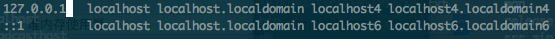

请将127.0.0.1修改为本地真实的IP,我的服务器IP是192.168.202.121：

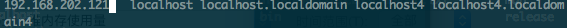

 **第四步**：查看JConsole

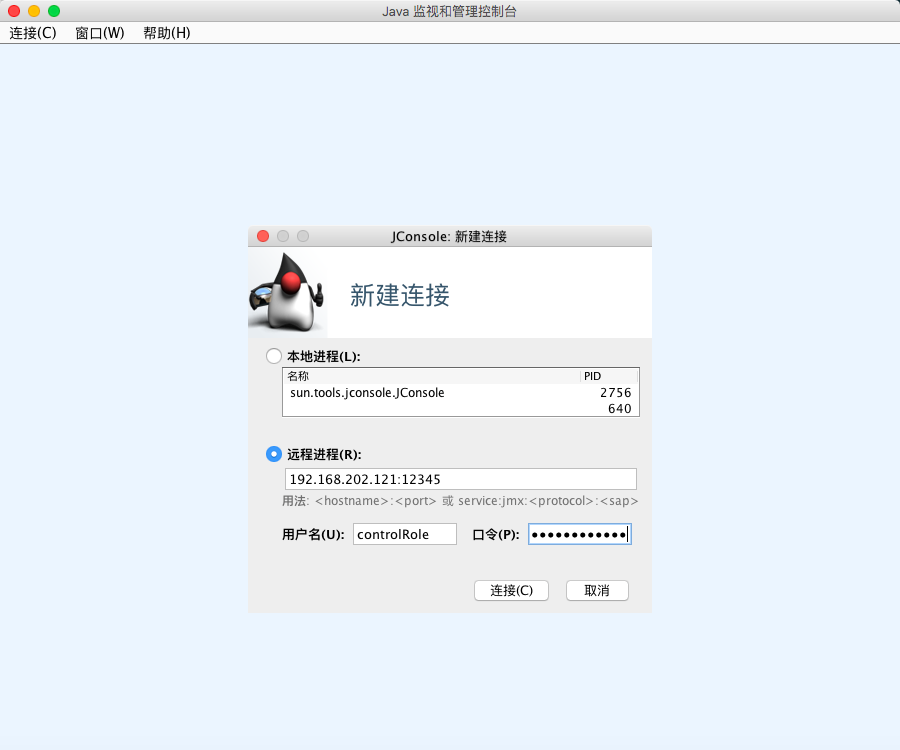

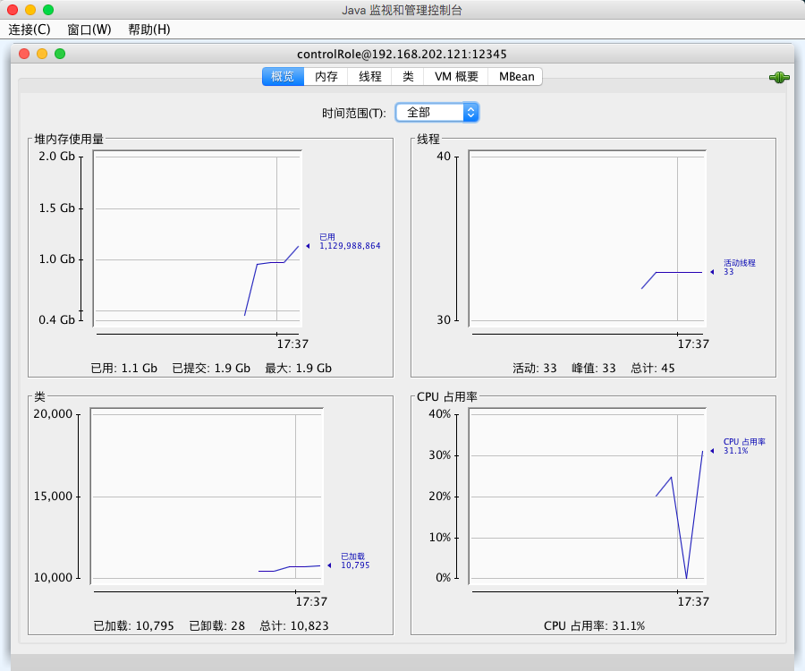


### jvisualvm

jvisualvm(JVM Monitoring/Troubleshooting/Profiling Tool)同jconsole都是一个基于图形化界面的、可以查看本地及远程的JAVA GUI监控工具，Jvisualvm同jconsole的使用方式一样，直接在命令行打入Jvisualvm即可启动，不过Jvisualvm相比，界面更美观一些，数据更实时。 jvisualvm的使用VisualVM进行远程连接的配置和JConsole是一摸一样的，最终效果图如下

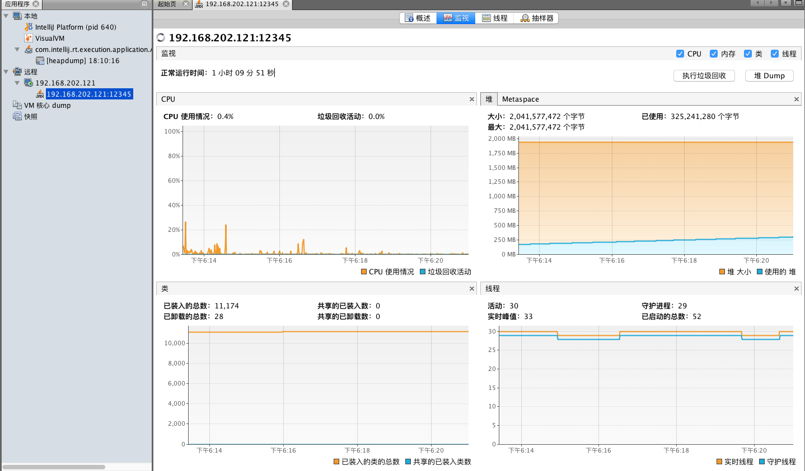


**Visual GC(监控垃圾回收器)**

Java VisualVM默认没有安装Visual GC插件，需要手动安装，JDK的安装目录的bin目露下双击 jvisualvm.sh，即可打开Java VisualVM，点击菜单栏： **工具->插件** 安装Visual GC，最终效果如下图所示：

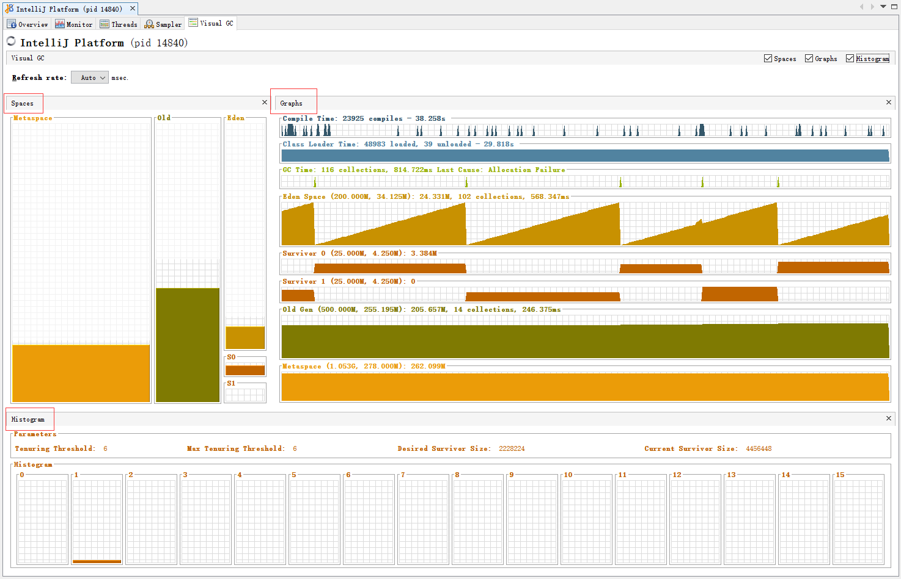


**大dump文件**

从服务器dump堆内存后文件比较大（5.5G左右），加载文件、查看实例对象都很慢，还提示配置xmx大小。表明给VisualVM分配的堆内存不够，找到$JAVA_HOME/lib/visualvm}/etc/visualvm.conf这个文件，修改：

```shell
default_options="-J-Xms24m -J-Xmx192m"
```

再重启VisualVM就行了。