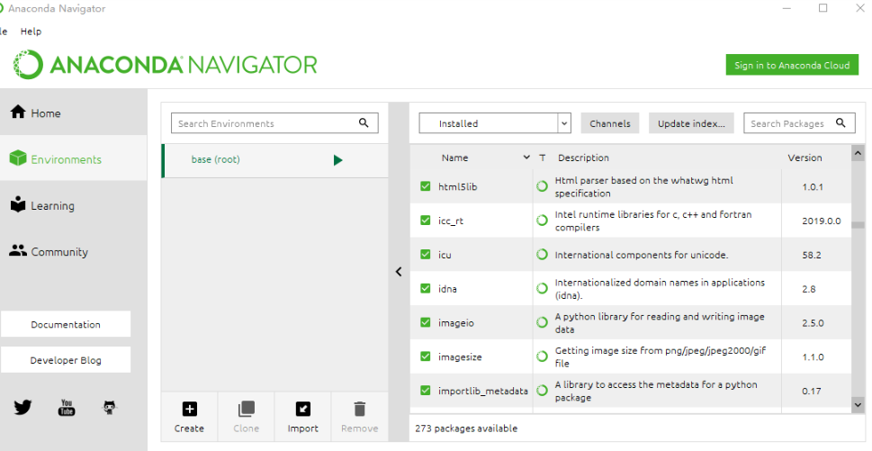

原本一开始的时候不想记录这篇文章，可是从自己初步接触python到目前为止，遇到的包混乱和python版本切换的问题层出不穷，也曾多次翻看其他人的博客和帖子寻求答案，耗时耗力不说，最终自己本地的开发环境也被污染了，作为一个有代码洁癖的人来说，很难忍受这这些，然后就一次又一次的重装系统...  
写这篇文章记录的时候，我是刚刚把系统重装结束，苦于教训，最终记录一下过程和这个工具的使用。  

### 用途  
Anaconda主要是用来做python的环境管理和包管理  
### 安装  
安装过于简单，这里不详细介绍，主要是下载。大多数人一开始都是习惯去官网下载，这里我也放出官网的下载地址[Anaconda下载](https://www.anaconda.com/)。在下载的过程中，你可能会过于痛苦，我第一次的时候是下载了半个小时，后来我找到一个东西，叫做[清华大学开源软件镜像站](https://mirror.tuna.tsinghua.edu.cn/help/anaconda/) ，当你打开这个下载的时候，你会发现，下载是如此的丝滑。  
  
### 操作教程  
这里介绍两种，安装完成后，加入环境变量，就可以起飞了，最简单的操作就是打开软件，在可视化界面操作   
#### 可视化界面 
  
* 点击Environment，则可以显示目前安装的所有环境
* create新建环境
* clone克隆环境
* remove删除环境   

#### 命令行
作为一个逼格满满的程序员怎么可以用可视化的界面呢？下面主要记录一下基本的命令使用
* 首选可定是我们的帮助命令，当你忘记怎么使用时，立刻在你的命令行，输`conda --help`  
* `conda --version` ： 显示Conda版本信息
* `conda update conda` ： 更新conda到最新版本
* `conda create --name env_name [package_name]` : 新创建一个名为env_name的环境，并在环境中安装名为package_name的包【可选操作】  
* `activate env_name` : ：将当前工作环境切换到名为env_name
* `conda create --name env_name python=3.6` ：新建一个环境并安装python3.6
* `conda search package_name` ：在Anaconda仓库中搜索名为package_name的包是否存在【需要联网】  
* `conda install package_name `：在当前环境下安装名为package_name的包
* `conda list` : 查看当前环境下安装的package信息
* `conda update --all` : 更新当前环境下安装的全部package到最新版本
* `conda update python` : 更新当前环境下python版本到当前python版本的最新版本
