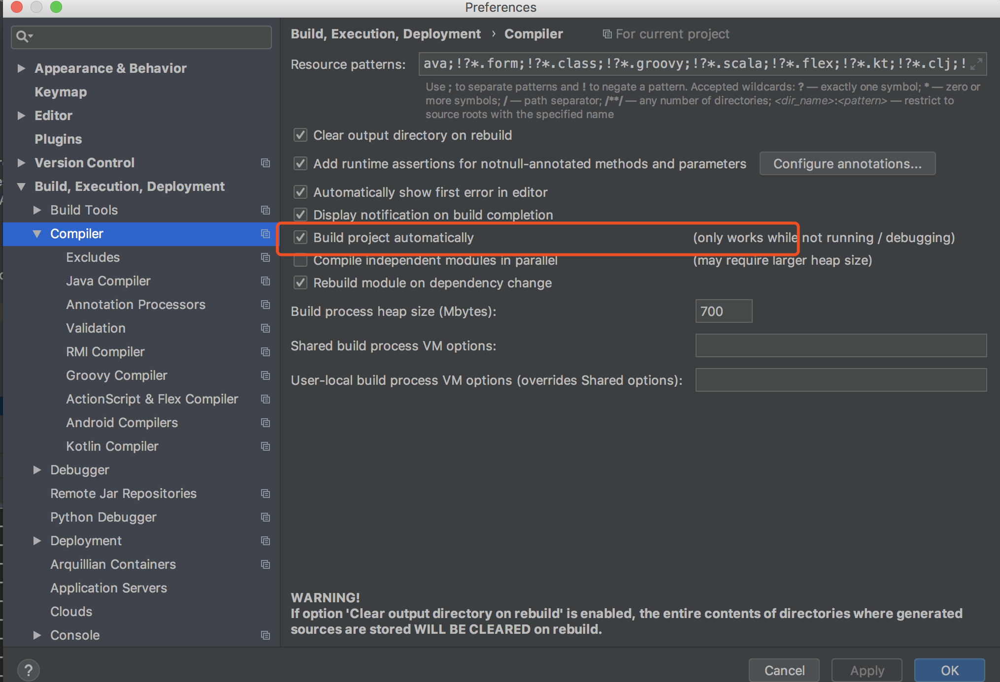

开发时，每次修改java代码，项目都需要重启，是不是很麻烦，这里提供一种热部署的方法，使用工具Devtools
```(java)
<dependency>
	<groupId>org.springframework.boot</groupId>
	<artifactId>spring-boot-Devtools</artifactId>
	<optional>true</optional>
</dependency>
```

<!-- more -->

```(java)
<build>
	<plugins>
		<plugin>
			<groupId>org.springframework.boot</groupId>
			<artifactId>spring-boot-maven-plugin</artifactId>
			<configuration>
				<fork>true</fork>
			</configuration>
		</plugin>
	</plugins>
</build>
```

如果是eclipse就已经可以了，如果是idea，还需要以下操作
  
commond + shift + A，输入Registry


