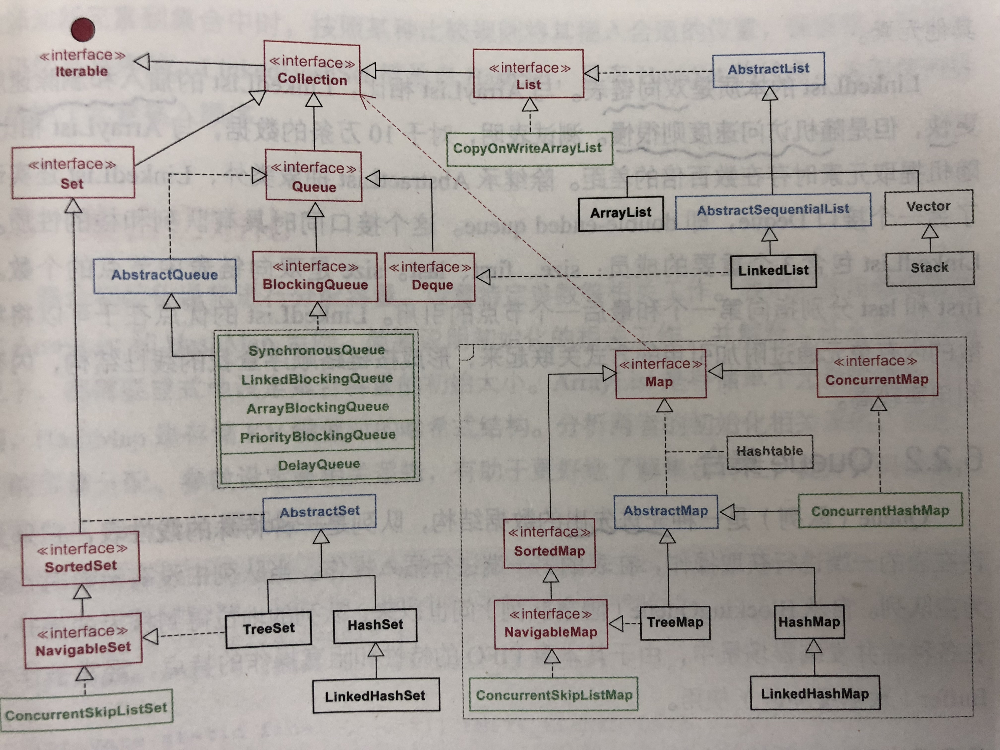
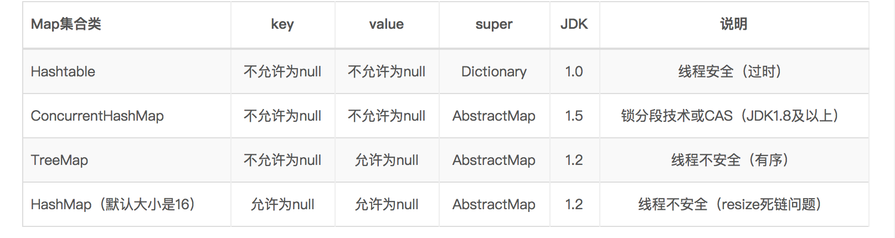

## 集合
  
备注：红色为接口，蓝色为抽象类，绿色代表并发包中的类，灰色代表早期线程安全的类（基本已经弃用）
<!-- more -->


### List(extends Collection)集合
> 线性数据结构的主要实现，通常存在明确的上一个和下一个元素，也存在明确的第一个和最后一个元素。该类最常用的是ArrayList和LinkedList

##### ArrayList(extends AbstractList<E> implements List<E>, RandomAccess, Cloneable, java.io.Serializable)
可以改变的非线程安全集合，默认大小是10   
```
/**
     * Appends the specified element to the end of this list.
     *
     * @param e element to be appended to this list
     * @return <tt>true</tt> (as specified by {@link Collection#add})
     */
    public boolean add(E e) {
        ensureCapacityInternal(size + 1);  // Increments modCount!!
        elementData[size++] = e;
        return true;
    }
```
通过看源码，可以看ArrayList是通过数组来进行存储的，不给长度的时候，默认值大小是10，集合添加元素时，会通过新建size++的数组，将原油数据拷贝到新的数组来实现，因此支持通过下标来访问元素，但是插入和删除的速度非常慢，因为这个过程是通过数组扩容来实现，因此很有可能要移动其他元素。  

##### LinkedList(extends AbstractSequentialList<E> implements List<E>, Deque<E>, Cloneable, java.io.Serializable)
本质是双向链表，插入和删除速度快，但是随机访问速度慢  

### Queue(extends Collection)集合
先进先出的数据结构，只允许在表的一端进行获取操作，在另一端进行插入操作

### Set（extends Collection）
不允许出现重复元素的集合，且最多一个null元素
##### SortedSet（extends Set）

### Map（Interface）
以key-value键值对作为存储元素实现的哈希结构,有唯一的key，每一个key都至少有一个value，取代了旧的抽象类Dictionary,拥有更好的性能。Map提供了三种collection视图



